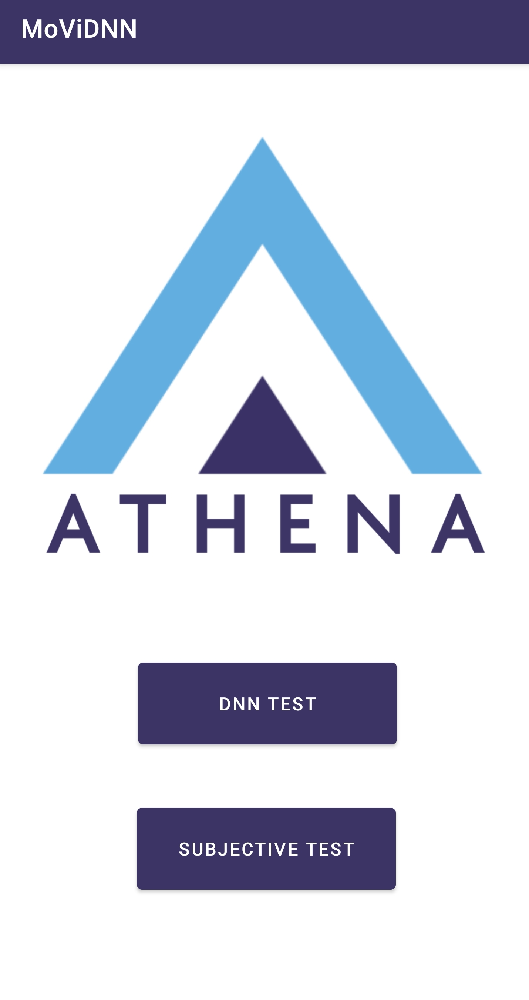
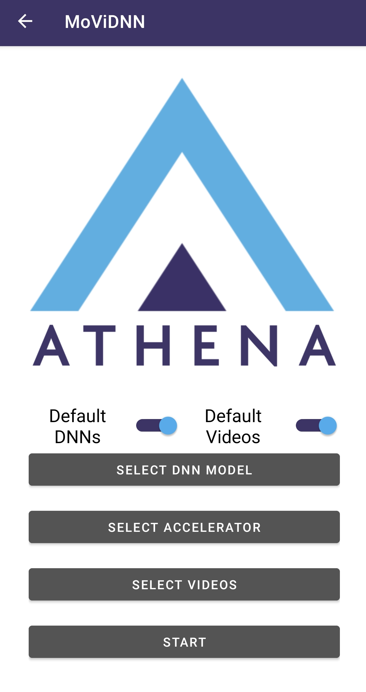
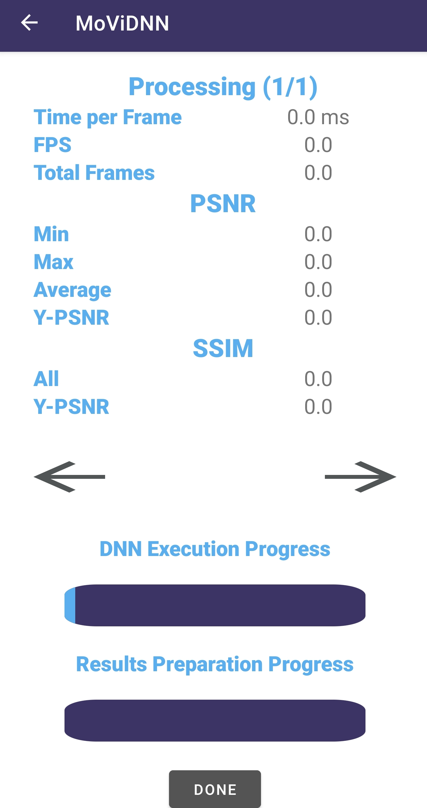
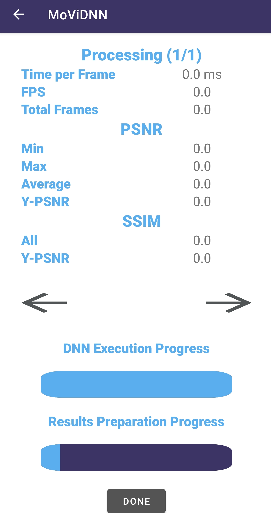
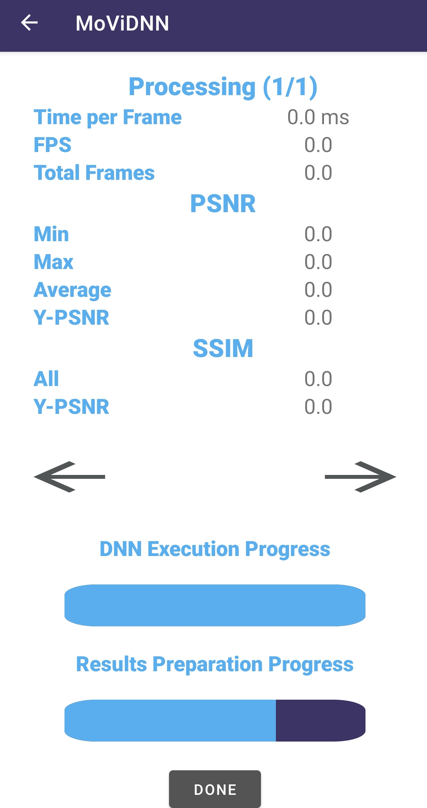
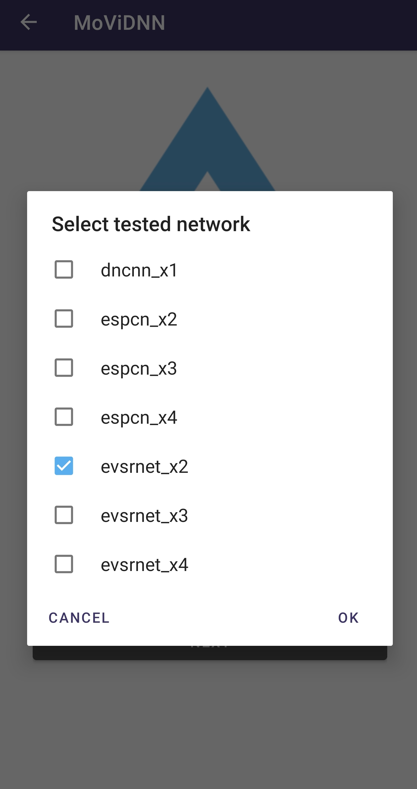
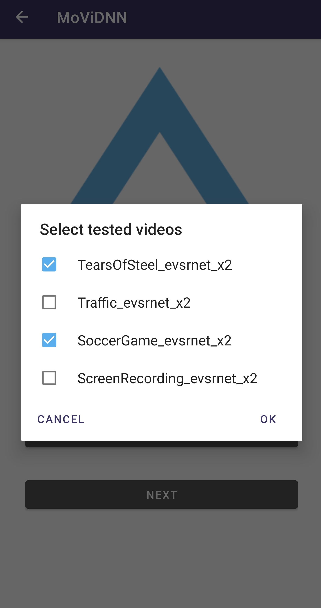
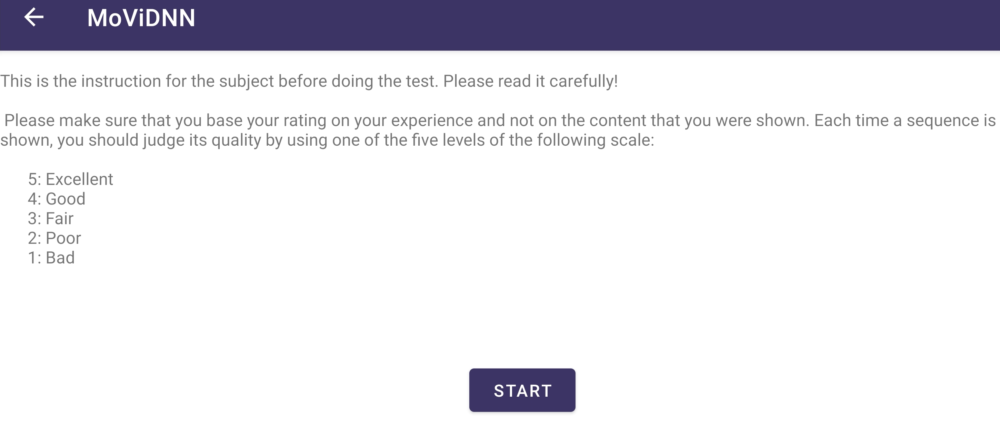
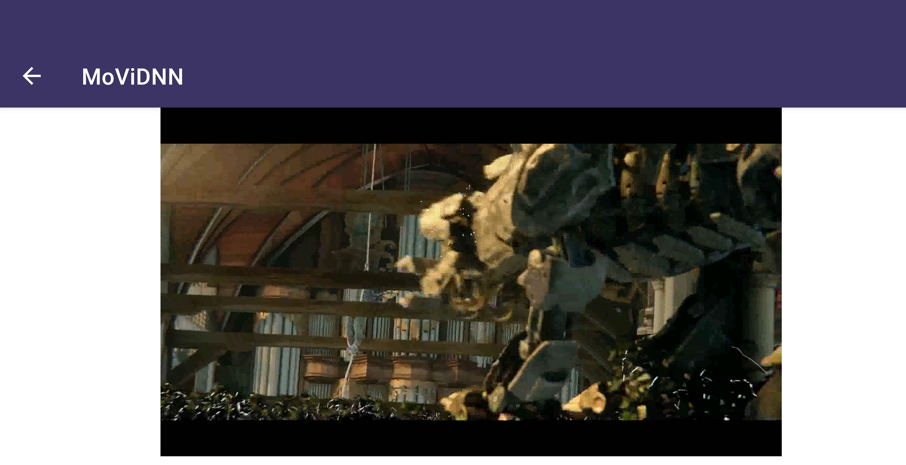
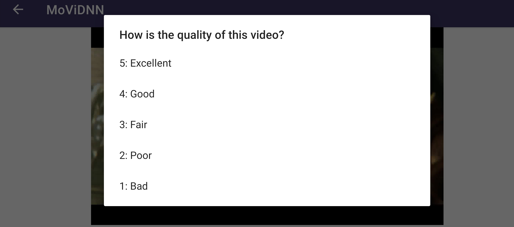

# MoViDNN: A Mobile Platform for Evaluating Video Quality Enhancement with Deep Neural Networks

<p float="left", align="center">
  
  
  
</p>

MoViDNN is an Android application that can be used to evaluate DNN based video quality enhancements for mobile devices. We provide the structure to evaluate both super-resolution, and denoising/deblocking DNNs in this application. However, the structure can be extended easily to adapt to additional approaches such as video frame interpolation.

Moreover, MoViDNN can also be used as a **Subjective** test environment to evaulate DNN based enhancements. 

We use [*tensorflow-lite*](https://www.tensorflow.org/lite) as the DNN framework and [*FFMPEG*](https://github.com/tanersener/ffmpeg-kit) for the video processing. 

We also provide a Python repository that can be used to convert existing Tensorflow/Keras models to **tensorflow-lite** versions for Android. [Preparation](https://github.com/cd-athena/MoViDNN/tree/main/TFLite_Quantization)


## DNN Evaluation

**MoViDNN** can be used as a platform to evaluate the performance of video quality enhancement DNNs. It provides objective metrics (PSNR and SSIM) for the whole video along with measuring the execution performance of the device (execution time, executed frames per second).


### DNN Configuration

<p align="left">
  
</p>

This is the first screen of the DNN test and in this screen the DNN, the accelerator, and input videos are selected which then will be used during the DNN evaluation.


### DNN Execution

<p float="left", align="center">
  
  
  
</p>

Once the configuration is completed, DNN execution activity is run. It begins with extracting each frame from the input video using FFMpeg and saving them into a temporary folder. Afterward, the DNN is applied for each frame, and results are saved into another temporary folder. Once the DNN applied frames are ready, they are converted to a video using FFMpeg again. Finally, objective metric calculations are done with FFMpeg using the DNN applied video and the input video. 

In this step, DNN applied video is saved into `DNNResults/Videos/` folder, and CSV file containing objective metrics for each video is saved into `DNNResults/Metrics/`folder.


### Adding New DNNs and Videos

MoVİDNN comes with 5 test videos, 2 SR models (ESPCN, EVSRNet), and one deblocking model (DnCNN). It is possible to add additional test videos and DNNs to MoViDNN. 

To add a new DNN model, use the [quantization script](https://github.com/cd-athena/MoViDNN/tree/main/TFLite_Quantization) to prepare it for MoViDNN. Once it is done, you can put your model into `/MoViDNN/Networks/`folder on your mobile device's storage and it will be ready for evaluation. Similarly, if you want to add new test videos, you can simply move them into `/MoViDNN/InputVideos/`folder in your device storage.

```
MoViDNN
│
└───Networks
│   │   dncnn_x1.tflite
│   │   espcn_x2.tflite
│   │
│   │  <YourModel>.py
└───InputVideos
│   │   SoccerGame.mp4
│   │   Traffic.mp4
│   │
│   │  <YourVideo>.mp4
..
```


## Subjective Evaluation

MoViDNN can also be used as a subjective test platform to evaluate the DNN applied videos. Once the DNN evaluation is done for a given network and the resulting video is saved, subjective test can be started.

<p float="left", align="center">
  
  
  
</p>

In the first screen, instructions are shown to the tester. Once they are read carefully, the test can be started. Subjective test part of the MoViDNN displays all the selected videos in a random order. After each video, the tester is asked to rate the video quality from 1 to 5. 

In the end, ratings are saved into a CSV file which can be used later.


<p float="left", align="center">
  
</p>

<p float="left", align="center">
  
</p>

<p float="left", align="center">
  
</p>

